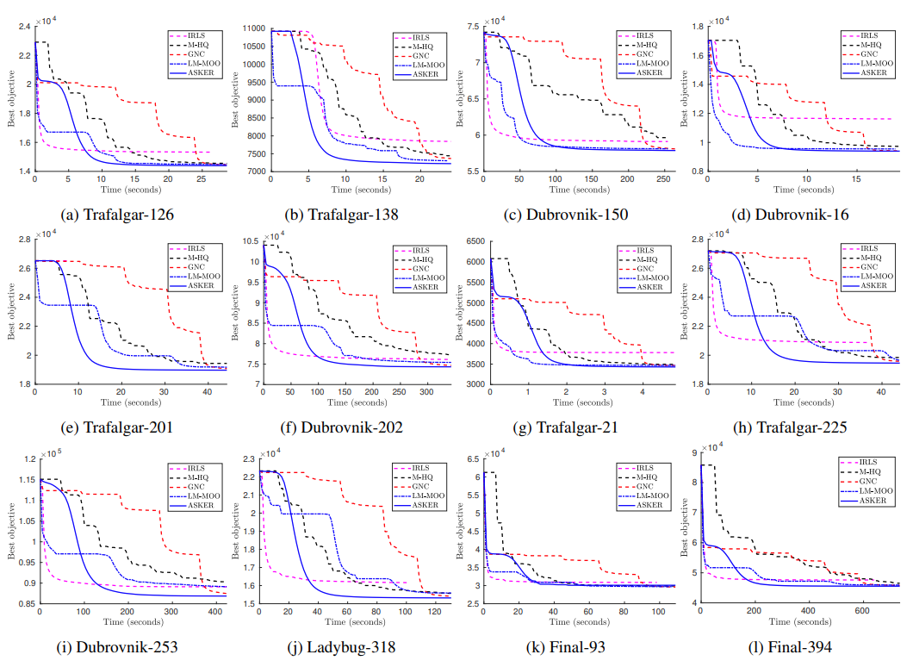
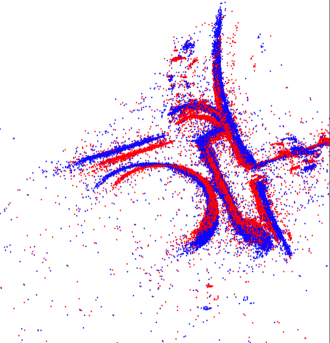

# ASKER - Adaptive Kernel Scaling
This repository contains the C++ implementation for the paper 

* Huu Le and Christopher Zach, "A Graduated Filter Method for Large Scale Robust Estimation", CVPR2020.

## Description
Our work is inspired by graduated non-convexity (GNC), which is the state-of-the-art algorithm for large-scale robust estimation in terms of escaping poor local minima. However, in contrast to GNC that requires a fixed optimization schedule, we propose a novel adaptive kernel scaling approach, which allows us to achieve comparable or lower objective but with much faster convergence rate compared to GNC.

The performance of our algorithm is shown in the below Figure (refer to the main paper for more details)
<center>  


</center>
<center>  


</center>

## Compilation:
This repository is tested on Ubuntu. Compilation on Windows and Mac support is not tested.

### Requirements:
Since colamd library is required, please install libsuitspare using the following command in Ubuntu:

`sudo apt-get install libsuitesparse-dev`

Create a build folder, then run cmake and build using the following commands:


```
mkdir build 
cd build
cmake ..
make -j4
```

If the compilation is successful, the algorithm can be run using the following syntax:

`asker <path/to/input/file.txt>`

where the input file is one of the bundle adjustment instances in the Bundle Adjustment In the Large dataset (https://grail.cs.washington.edu/projects/bal/)
