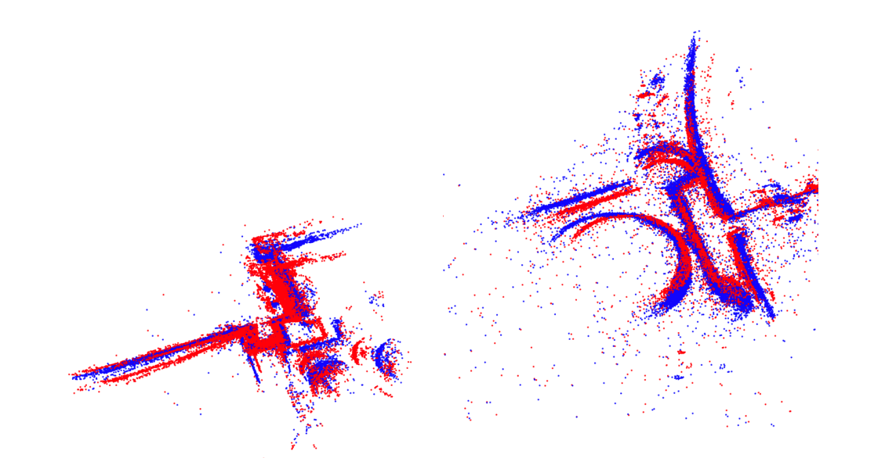

# ASKER - Adaptive Scaling of KERnels
This repository contains the C++ implementation of the algorithm described in the paper 

* Huu Le and Christopher Zach, "A Graduated Filter Method for Large Scale Robust Estimation", CVPR2020.

```
@inproceedings{le2020asker,
  title={A Graduated Filter Method for Large Scale Robust Estimation},
  author={Le, Huu and Zach, Christopher},
  booktitle={Proceedings of the IEEE Conference on Computer Vision and Pattern Recognition},
  year={2020}
}
```

For comparison, this repository also contains the implementation of MOO introduced in
* Christopher Zach, "Pareto Meets Huber: Efficiently Avoiding Poor Minima in Robust Estimation", ICCV2019.
```
@inproceedings{zach2019pareto,
  title={Pareto Meets Huber: Efficiently Avoiding Poor Minima in Robust Estimation},
  author={Zach, Christopher and Bourmaud, Guillaume},
  booktitle={Proceedings of the IEEE International Conference on Computer Vision},
  pages={10243--10251},
  year={2019}
}
```
This repository is built mainly upon the SSBA library (https://github.com/chzach/SSBA) developed by Prof. Christopher Zach.

## Description
Our work is inspired by graduated non-convexity (GNC), which is the state-of-the-art algorithm for large-scale robust estimation in terms of escaping poor local minima. However, in contrast to GNC that requires a fixed optimization schedule, we propose a novel adaptive kernel scaling approach, which allows us to achieve comparable or lower objective but with much faster convergence rate compared to GNC.

The performance of our algorithm is shown in the below Figure (refer to the main paper for more details)
<center>  


</center>

Examples of the final structures obtained by ASKER (blue) compared to IRLS (red). ASKER is able to escape poor local minima, thus achieves better structured compared to IRLS.
<center>  


</center>

## Compilation:
Our source code was tested on an Ubuntu machine. Compilation on Windows and Mac has yet to be done.

### Requirements:
Since colamd library is required, please install libsuitspare using the following command in Ubuntu:

`$ sudo apt-get install libsuitesparse-dev`

### Building
Create a build folder, then run cmake and build using the following commands:

```
$ mkdir build 
$ cd build
$ cmake ..
$ make -j8
```

If the compilation is successful, the ASKER and MOO can be run using the following syntax, respectively:

`$ asker <path/to/input/file.txt>`

`$ moo <path/to/input/file.txt>`

where the input file is one of the bundle adjustment instances in the Bundle Adjustment In the Large dataset (https://grail.cs.washington.edu/projects/bal/)

An example instance is provided in the Data folder, so the following command can be execute from the build folder to test the compilation:

`asker ../Data/example_data.txt`

`moo ../Data/example_data.txt`